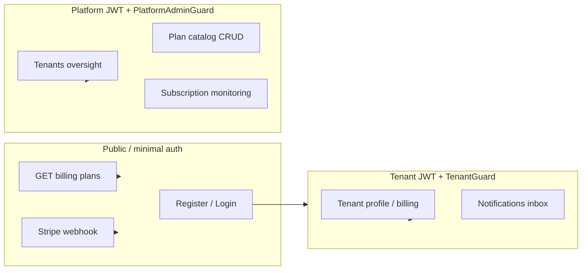
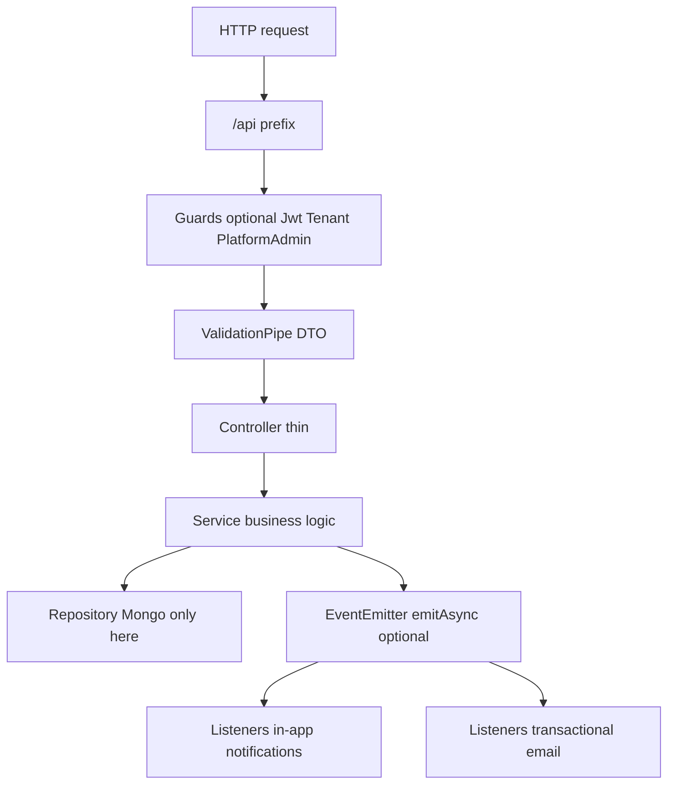
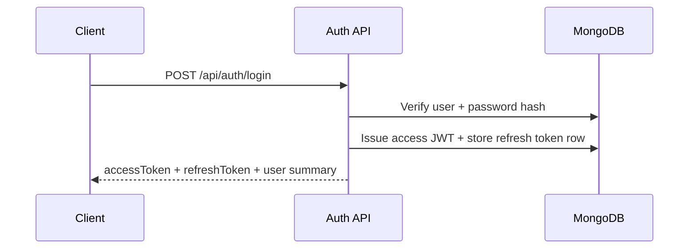
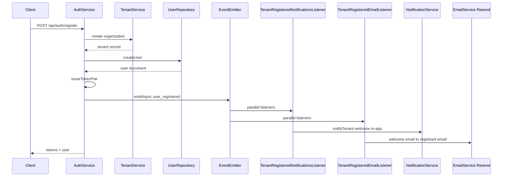
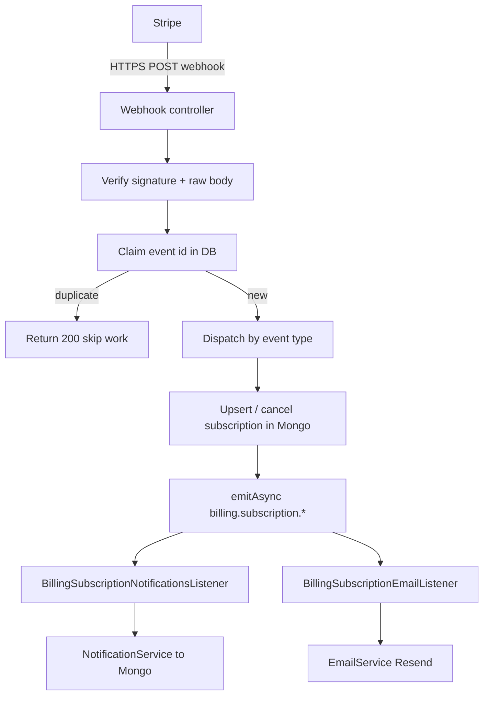

# Knowledge transfer: SaaS backend

This document is for anyone taking over or demoing the project. It explains **what works today**, **how data moves through the system**, and **what is not built yet**.

---

## 1. What this backend is

A **multi-tenant SaaS API** built with **NestJS**, **MongoDB (Mongoose)**, and **Stripe** for subscriptions. Each **organization** is a **tenant**. Normal users belong to one tenant. A **platform operator** (superadmin) can act across all tenants for support and catalog management.

All HTTP routes live under the **`/api`** prefix. Example: `GET /api/auth/status`.

**Live contract:** Open **Swagger** at **`/api/docs`** after starting the server.

---

## 2. Tech stack (short)

| Piece | Role |
|--------|------|
| NestJS | HTTP API, modules, dependency injection |
| MongoDB + Mongoose | Persistent data |
| JWT | Access token (short-lived) |
| Stored refresh tokens | Opaque refresh token in DB (rotation on refresh) |
| Stripe | Checkout, customer portal, webhooks for subscription truth |
| `@nestjs/event-emitter` | In-process domain events (no Redis required) |
| **Resend** | Transactional email over HTTPS API; optional if env incomplete |

---

## 3. Two kinds of users

| Role | Who | JWT hints | Typical routes |
|------|-----|-----------|----------------|
| **Tenant user** | Customer org member | `tenantId` required for org-scoped actions | `/api/tenants/...`, `/api/billing/...` (authenticated) |
| **Platform operator** | Internal admin | `platformAdmin: true` | `/api/platform/...`, plan admin on `/api/platform/subscription-plans/...` |

Registration **only** creates **tenant users** (new org + first user). Platform admins are not created through public register.

**Flow (who calls what):**

---

## 4. Modules: what is implemented vs placeholder

| Module | Status | What you get |
|--------|--------|----------------|
| **Auth** | Implemented | Register, login, refresh (rotation), logout, `me`; bcrypt passwords |
| **Tenant** | Implemented | Current org from JWT; update org (`tenants/me`) |
| **Platform** | Implemented | Tenant list/detail/update/soft-delete, platform overview counts |
| **Billing** | Implemented | Public plans, tenant checkout + portal, Stripe webhook, plan catalog (admin), platform subscription list/detail |
| **Notification** | Implemented | In-app notifications; **listeners** subscribe to domain events |
| **Email** | Implemented | **Listeners** on the same registration and billing events send mail via `EmailService` (Resend) |
| **User** | Partial | Health + example DTO endpoint (not full member management); **earliest user email** used as billing mail recipient |
| **Workspace** | Placeholder | Module health only (no task system yet) |
| **File** | Placeholder | Module health only (no Azure uploads yet) |

---

## 5. Multi-tenancy (rules of the road)

- **Tenant id comes from the JWT** on org-scoped routes, not from arbitrary client fields (guards enforce this pattern).
- **Data access** for normal users is scoped by `tenantId` in repositories.
- **Cross-tenant reads/writes** happen only in **platform** code paths (e.g. `*ForPlatformAdmin`-style repository usage).

---

## 6. Request path (mental model)

- **Controllers** should stay thin; **services** hold rules; **repositories** own Mongoose models and queries.

---

## 7. Authentication flows

### 7.1 Login

### 7.2 Register (new organization + first user)

1. Validate email is new.
2. Create **tenant** (organization).
3. Create **user** with `tenantId`.
4. Issue **access + refresh** token pair.
5. Emit **`tenant.auth.user_registered`** (see `src/common/domain-events/tenant-auth.domain-events.ts`).
   

If token issuance fails after user creation, registration compensates by removing the tenant (existing behavior).

---

## 8. Billing and Stripe

### 8.1 Tenant-facing billing

- **GET `/api/billing/plans`** — sellable catalog (public).
- **GET `/api/billing/subscription`** — current org subscription snapshot (requires tenant JWT).
- **POST `/api/billing/checkout-session`** — starts Stripe Checkout.
- **POST `/api/billing/portal-session`** — Stripe billing portal.

Platform-only operators are blocked from checkout/portal (no normal tenant billing context).

### 8.2 Webhook (source of truth for paid state)

Stripe calls **`POST /stripe/webhook`** with a signed payload. The API:

1. Verifies **Stripe signature** (needs **raw body** in server config).
2. **Claims** the event id (idempotent: duplicates are ignored).
3. Updates **Mongo subscription** (and related) as needed.
4. Publishes **domain events** (see **Domain events** section below). Multiple **listeners** react in parallel: **in-app notifications** and **transactional email** (when Resend is configured).

Handled event types include (among others): `checkout.session.completed`, `customer.subscription.updated`, `customer.subscription.deleted`, `invoice.payment_failed`, `invoice.paid`.

### 8.3 Platform billing oversight

- **GET `/api/platform/subscriptions`** — paginated list of subscription rows (filters: `status`, `tenantId`).
- **GET `/api/platform/subscriptions/:tenantId`** — one org’s snapshot (includes Stripe customer id and timestamps for support).
- **Plan catalog:** **`/api/platform/subscription-plans`** — create/update/archive (admin); some GET routes are public for catalog browsing (see Swagger).

**Note:** Orgs that never hit billing may have **no row** in the subscriptions collection; list endpoints only show persisted rows.

---

## 9. Domain events (in-process)

**Package:** `@nestjs/event-emitter`. The event bus itself needs **no** env vars.

| Area | When | Event names (exact strings in code) |
|------|------|-------------------------------------|
| Registration | After successful signup + tokens | `tenant.auth.user_registered` |
| Stripe webhook | After subscription DB updates / invoice handling | `billing.subscription.checkout_completed`, `.updated`, `.ended`, `.invoice_payment_failed`, `.invoice_paid` |

**Multiple listeners per event:** For each name above, **notification** listeners (`notification/listeners/`) write **in-app** rows, and **email** listeners (`email/listeners/`) send mail via **Resend** when `EmailService` is configured. Producers (`AuthService`, `StripeWebhookService`) only **`emitAsync`**; they do not import `NotificationService` or `EmailService`, which keeps coupling low.

Events run **inside the same Node process**. They are **not** a message queue; for BullMQ/Redis you would add that separately.

---

## 10. Transactional email (Resend)

| Piece | Location / behavior |
|--------|---------------------|
| **Service** | `src/email/email.service.ts` — Resend HTTP API (`resend` package) |
| **Welcome** | `TenantRegisteredEmailListener` — sends to the **new user’s email** from the registration payload |
| **Billing** | `BillingSubscriptionEmailListener` — resolves recipient via **`UserRepository.findEarliestUserEmailByTenantId`** (first user by `createdAt`, i.e. org creator in the current model) |

If `RESEND_API_KEY` or `RESEND_FROM_EMAIL` are missing, **`EmailService` logs once and skips sends**; API behavior (register, webhooks) is unchanged. Resend API errors are logged and do not fail HTTP handlers.

**Portfolio caveat:** Multi-user orgs may eventually need a dedicated **billing contact** field; today “earliest user” is a deliberate default.

---

## 11. Platform admin: tenants

Under **`/api/platform`** (JWT + platform admin):

- Overview counts (active tenants, pending purge, users).
- List tenants (pagination, search, filters).
- Get / patch / soft-delete tenant.

Soft-deleted tenants follow a **TTL purge** story (Mongo removes documents after retention).

---

## 12. Notifications

- **GET `/api/notifications/in-app`** — recent notifications for the **current tenant** (JWT + `TenantGuard`).

Types include subscription lifecycle + welcome (`organization_registered`) after register.

---

## 13. Environment variables (high level)

- **Event emitter:** no dedicated variables (in-process only).
- **Transactional email:** `RESEND_API_KEY`, `RESEND_FROM_EMAIL` (use a **`noreply@`** address on your verified domain — replies still hit SMTP if someone presses Reply; unmonitored mailbox + template footer state policy). Optional **`PLATFORM_BRAND_NAME`** (default **`Asteriq.in`**) drives the visible sender name (shown as **“… (No reply)”**), `[Brand]` subject prefix, and HTML template header/footer.

Also:

- `MONGODB_URI`
- `JWT_*` secrets and expiry settings
- Stripe keys and webhook secret
- `FRONTEND_BASE_URL` (checkout/portal return URLs + email links)

Use **`.env.example`** as the checklist (do not commit real secrets).

---

## 14. Out of scope / not done yet

These are called out so nobody assumes they exist:

- **BullMQ + Redis** (async job workers).
- **Workspace task system** (Jira-lite) from product rules.
- **Azure file uploads** (pre-signed flow).
- **Platform-created tenants** via `POST /platform/tenants` (registration remains the org-creation path for this portfolio).
- **Full user/member admin** beyond current `users` sample endpoint.

---

## 15. Who to read next

1. **Swagger** `/api/docs` for exact payloads and status codes.
2. **`cursor/rules`** in the repo root for architectural intentions (modules, guards, billing rules).
3. **Source:** `auth/`, `tenant/`, `platform/`, `billing/`, `notification/`, `email/`, especially `stripe-webhook.service.ts`, `notification/listeners/`, and `email/listeners/`.

If you extend the system, keep **webhook idempotency** and **tenant scoping** in mind; they are easy to break if you bypass repositories or trust client-supplied tenant ids.
